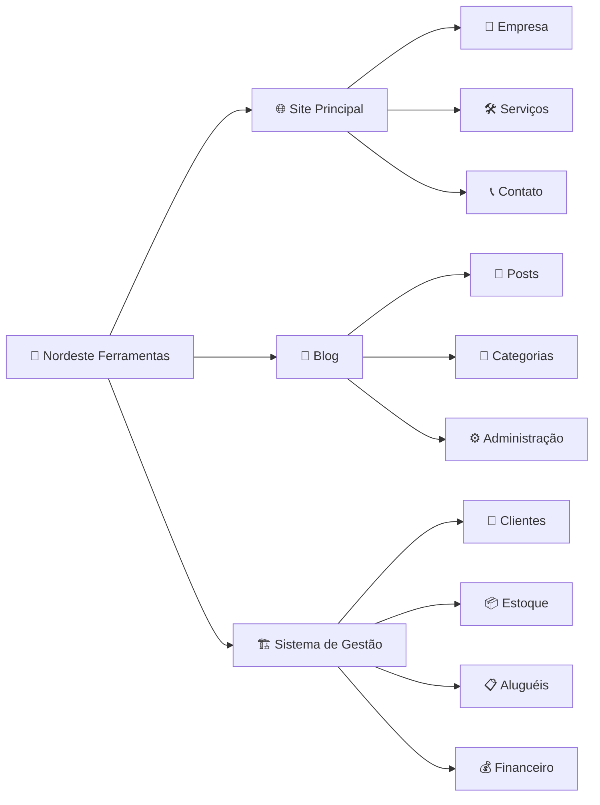
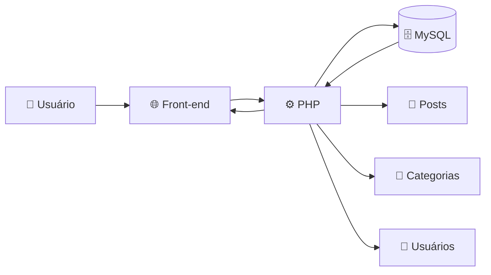
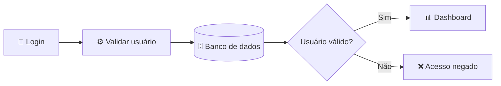
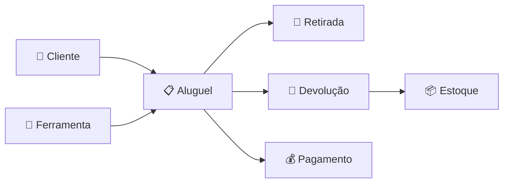
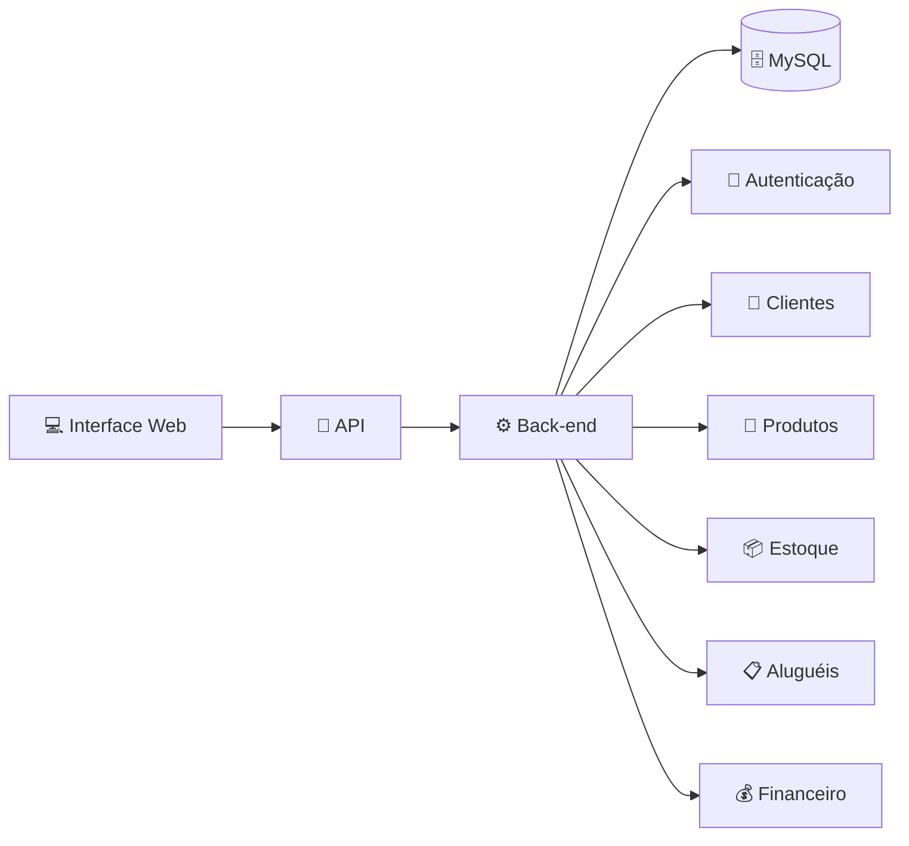
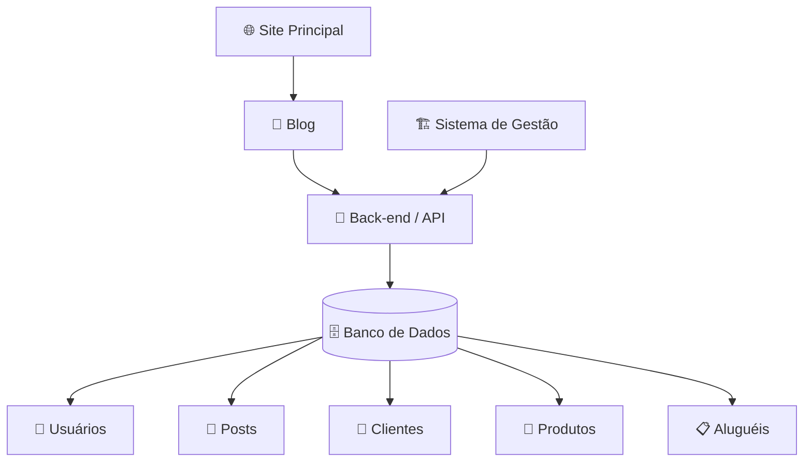

<div align="center">


<br>


<br><br>


<br><br>

Projeto criado inicialmente para atender uma empresa do setor de ferramentas e que, durante seu desenvolvimento, começou a evoluir para um ecossistema digital completo.

</div>

---

# 📌 Sobre o projeto

O **Nordeste Ferramentas** começou como um projeto desenvolvido para uma empresa de ferramentas de um amigo.

A ideia inicial era relativamente simples: criar um site onde a empresa pudesse apresentar seus serviços, produtos e informações de contato.

Durante o desenvolvimento, percebi que o projeto poderia ir muito além de um site institucional.

A proposta então começou a evoluir para uma estrutura maior, dividida em **três partes principais**:

| Módulo | Objetivo | Status |
|---|---|---|
| 🌐 **Site Principal** | Presença institucional da empresa na internet | 🟡 Em evolução |
| 📰 **Blog** | Conteúdo sobre ferramentas, construção e conhecimento técnico | 🟡 Em desenvolvimento |
| 🏗️ **Sistema de Gestão** | Controle interno de clientes, aluguéis, produtos e operações | ⚪ Planejado |

---

# 🧭 Visão geral



---

# 🧩 Estrutura atual do projeto

```text
Nordeste_Ferramentas/
│
├── .vscode/
│
├── nf_blog/
│   │
│   ├── .vscode/
│   ├── Images/
│   ├── txt/
│   │
│   ├── about.html
│   ├── add-category.html
│   ├── add-post.html
│   ├── add-user.html
│   ├── blog.html
│   ├── category-post.html
│   ├── contact.html
│   ├── dashboard.html
│   ├── edit-category.html
│   ├── edit-post.html
│   ├── edit-user.html
│   ├── index.html
│   ├── main.js
│   ├── manage-categories.html
│   ├── manage-users.html
│   ├── post.html
│   ├── services.html
│   ├── signin.html
│   ├── signup.html
│   └── style.css
│
├── site_principal/
│   │
│   ├── icon/
│   ├── images/
│   ├── txt/
│   │
│   ├── index.html
│   ├── script.js
│   └── style.css
│
├── .gitattributes
├── Diario de um dev.txt
├── LICENSE
└── README.md
```

---

# 🌐 01 — Site Principal

O primeiro módulo do projeto é o **site institucional da Nordeste Ferramentas**.

Ele funciona como a principal apresentação da empresa na internet e foi o ponto de partida de todo o projeto.

## 🎯 Principais objetivos

- Apresentar a empresa;
- Mostrar seus serviços;
- Divulgar produtos e soluções;
- Disponibilizar meios de contato;
- Criar uma identidade digital para a marca;
- Direcionar visitantes para outros serviços da empresa;
- Criar uma base para futuras integrações com o blog e o sistema interno.

## 💻 Tecnologias

<div align="center">


</div>

O site principal foi desenvolvido inicialmente utilizando **HTML, CSS e JavaScript**, mantendo uma estrutura relativamente simples e permitindo que novas funcionalidades sejam adicionadas conforme o projeto evolui.

---

# 📰 02 — Nordeste Ferramentas Blog

O segundo módulo nasceu com uma proposta diferente.

Além de utilizar o site como uma vitrine para a empresa, surgiu a ideia de criar um espaço destinado à **produção de conteúdo relacionado ao universo das ferramentas e da construção**.

A proposta do blog é permitir que a Nordeste Ferramentas também possa compartilhar conhecimento.

## 📚 Conteúdos

O blog poderá abordar assuntos como:

| Tema | Conteúdo |
|---|---|
| 🔨 **Ferramentas** | Uso, escolha e características de diferentes ferramentas |
| 🏗️ **Construção** | Conteúdos relacionados à construção civil |
| 🧱 **Obras** | Informações e boas práticas para diferentes tipos de obra |
| 🪚 **Manutenção** | Cuidados, conservação e utilização dos equipamentos |
| ⚙️ **Equipamentos** | Explicação sobre máquinas e equipamentos |
| 📚 **Educação** | Conteúdos destinados a ensinar e compartilhar conhecimento |

A proposta é transformar o site da empresa não apenas em uma vitrine comercial, mas também em uma **fonte de informação para pessoas que trabalham ou possuem interesse nessa área**.

---

## ⚙️ Área administrativa

O projeto do blog também prevê uma área interna destinada ao gerenciamento do conteúdo.

Atualmente sua estrutura já possui páginas destinadas a diferentes operações administrativas:

| Funcionalidade | Descrição |
|---|---|
| 👤 **Login** | Acesso ao painel administrativo |
| 📝 **Posts** | Criação e edição de publicações |
| 📂 **Categorias** | Organização dos conteúdos |
| 👥 **Usuários** | Administração dos usuários do sistema |
| 📊 **Dashboard** | Painel central da área administrativa |
| ➕ **Adicionar posts** | Cadastro de novas publicações |
| ✏️ **Editar posts** | Alteração de publicações existentes |
| ➕ **Adicionar categorias** | Cadastro de categorias |
| ✏️ **Editar categorias** | Alteração das categorias existentes |
| ➕ **Adicionar usuários** | Cadastro de novos usuários |
| ✏️ **Editar usuários** | Alteração dos usuários cadastrados |

---

## 🧠 Arquitetura planejada para o Blog

A interface do blog começou sendo construída com HTML, CSS e JavaScript.

Para transformar essa estrutura em uma aplicação realmente dinâmica, o back-end está sendo pensado utilizando **PHP com MySQL**.



Essa estrutura permitirá que informações que atualmente fariam parte de páginas estáticas passem a ser armazenadas e gerenciadas através do banco de dados.

---

## 🗄️ Banco de dados do Blog

O **MySQL** será utilizado para armazenar informações importantes da aplicação.

Entre elas:

```text
Usuários
   │
   ├── Nome
   ├── Email
   ├── Senha
   └── Permissão

Posts
   │
   ├── Título
   ├── Conteúdo
   ├── Autor
   ├── Categoria
   └── Data

Categorias
   │
   ├── Nome
   └── Descrição
```

Com isso, funcionalidades como login, criação de publicações e gerenciamento de usuários poderão acontecer dinamicamente.

---

## 🔐 Autenticação

Outro ponto previsto para o desenvolvimento do back-end é um sistema de autenticação para separar a área pública da área administrativa.

Uma estrutura inicial poderá funcionar assim:



A autenticação também permitirá que futuramente sejam implementados diferentes níveis de permissão.

---

# 🏗️ 03 — Sistema de Gestão

Essa será a parte mais extensa do projeto.

A ideia é desenvolver um **sistema interno para auxiliar na administração da própria empresa**.

Esse módulo ainda não começou a ser programado e atualmente está em fase de planejamento.

Porém, a ideia inicial é que o sistema centralize informações que normalmente ficariam espalhadas entre planilhas, documentos ou controles separados.

---

## 🧰 Módulos planejados

```text
                      🔧 NORDESTE FERRAMENTAS
                               │
                               ▼
                       🏗️ SISTEMA DE GESTÃO
                               │
          ┌────────────────────┼────────────────────┐
          │                    │                    │
          ▼                    ▼                    ▼
     👥 Clientes          🔧 Produtos          📦 Estoque
          │                    │                    │
          └───────────────┐    │    ┌───────────────┘
                          ▼    ▼
                        📋 Aluguéis
                            │
              ┌─────────────┼─────────────┐
              │             │             │
              ▼             ▼             ▼
        📅 Prazos      🔄 Devoluções   💰 Pagamentos
              │             │             │
              └─────────────┼─────────────┘
                            ▼
                      📊 Dashboard
```

Entre as funcionalidades previstas estão:

- Cadastro de clientes;
- Cadastro de produtos;
- Cadastro de ferramentas;
- Controle de estoque;
- Registro de compras;
- Registro de aluguéis;
- Controle das datas de retirada;
- Controle das datas de devolução;
- Histórico de aluguéis;
- Histórico dos clientes;
- Controle da situação dos equipamentos;
- Registro de pagamentos;
- Controle financeiro;
- Relatórios;
- Dashboard administrativo.

---

# 👥 Gestão de clientes

O sistema poderá manter um cadastro centralizado dos clientes da empresa.

Cada cliente poderá possuir informações como:

- Nome;
- Documento;
- Telefone;
- Email;
- Endereço;
- Histórico de aluguéis;
- Pagamentos;
- Pendências;
- Equipamentos alugados.

Isso permitirá que a empresa acompanhe todo o relacionamento com cada cliente através do próprio sistema.

---

# 🔧 Gestão de ferramentas

Cada ferramenta poderá possuir um cadastro próprio.

Por exemplo:

| Informação | Exemplo |
|---|---|
| Código | NF-0001 |
| Ferramenta | Furadeira |
| Categoria | Ferramenta elétrica |
| Status | Disponível |
| Quantidade | 5 |
| Valor de aluguel | R$ -- |
| Data de aquisição | -- |
| Condição | Nova / Boa / Manutenção |

Dessa maneira, o sistema poderá saber quais equipamentos estão disponíveis, alugados ou em manutenção.

---

# 📋 Sistema de aluguel

O módulo de aluguel deverá conectar diferentes partes do sistema.



Um aluguel poderá relacionar:

- Cliente;
- Ferramenta;
- Quantidade;
- Data da retirada;
- Data prevista para devolução;
- Data real da devolução;
- Valor;
- Forma de pagamento;
- Situação do aluguel.

---

# 📦 Controle de estoque

O estoque deverá trabalhar de maneira integrada com os aluguéis.

Quando uma ferramenta for retirada, sua disponibilidade poderá ser atualizada.

Quando for devolvida, poderá voltar ao estoque ou ser encaminhada para manutenção.

```text
DISPONÍVEL
     │
     ▼
  ALUGADO
     │
     ▼
  DEVOLVIDO
     │
     ├──────────► DISPONÍVEL
     │
     └──────────► MANUTENÇÃO
```

---

# 💰 Controle financeiro

Outra possibilidade para o sistema é manter um controle básico das operações financeiras relacionadas aos aluguéis.

Isso poderá envolver:

- Valores recebidos;
- Pagamentos pendentes;
- Compras realizadas;
- Custos de manutenção;
- Histórico de pagamentos;
- Receita gerada por aluguel.

Esse módulo poderá ser expandido futuramente conforme as necessidades reais da empresa forem melhor compreendidas.

---

# 📊 Dashboard

A intenção é que o sistema possua um painel administrativo capaz de apresentar rapidamente informações importantes da empresa.

Alguns indicadores que poderão aparecer no dashboard:

| Indicador | Informação |
|---|---|
| 🔧 Ferramentas disponíveis | Quantidade disponível para aluguel |
| 📋 Aluguéis ativos | Quantidade atualmente em andamento |
| ⏰ Devoluções próximas | Equipamentos próximos da data de devolução |
| ⚠️ Aluguéis atrasados | Devoluções fora do prazo |
| 👥 Clientes | Quantidade cadastrada |
| 💰 Receita | Valores gerados pelos aluguéis |
| 🛠️ Manutenção | Ferramentas indisponíveis por manutenção |

---

# 🧱 Arquitetura pensada para o futuro sistema

Como o sistema terá diversas informações relacionadas entre si, uma abordagem baseada em **aplicação web, API e banco de dados relacional** parece ser um caminho interessante.

Uma possível arquitetura seria:



---

# 🚀 Possível stack futura

As tecnologias do sistema de gestão **ainda não estão definidas definitivamente**.

Porém, considerando o tipo de aplicação e a experiência que será adquirida durante o desenvolvimento do Blog Nordeste Ferramentas, uma possível stack seria:

<div align="center">


</div>

| Camada | Possível tecnologia |
|---|---|
| 🎨 **Front-end** | HTML, CSS e JavaScript |
| ⚙️ **Back-end** | PHP |
| 🧱 **Framework** | Laravel |
| 🔗 **Comunicação** | API REST |
| 🗄️ **Banco de dados** | MySQL |
| 🔐 **Autenticação** | Sistema de autenticação e permissões |
| 🌐 **Servidor** | Apache ou Nginx |
| 📦 **Versionamento** | Git |
| ☁️ **Repositório** | GitHub |

O **Laravel** aparece como uma possibilidade interessante porque permitiria continuar utilizando PHP, mas com uma estrutura mais organizada para desenvolver uma aplicação de maior porte.

Recursos como:

- Rotas;
- Controllers;
- Models;
- Migrations;
- Middlewares;
- Autenticação;
- Validação de dados;
- APIs;

poderiam facilitar bastante a construção de um sistema dividido em vários módulos.

Essa arquitetura ainda poderá mudar conforme os requisitos reais do sistema forem definidos.

---

# 🔄 Como os módulos poderão se conectar

A longo prazo, a ideia é que os três projetos deixem de funcionar como aplicações completamente separadas.



O objetivo é construir aos poucos um **ecossistema Nordeste Ferramentas**, onde cada módulo possui sua função, mas pode compartilhar informações e serviços quando necessário.

---

# 🗺️ Evolução do projeto

```text
🌐 Site institucional
        │
        ▼
🎨 Identidade digital da empresa
        │
        ▼
📰 Blog
        │
        ▼
⚙️ Área administrativa
        │
        ▼
🐘 PHP + MySQL
        │
        ▼
🔗 Back-end
        │
        ▼
🏗️ Sistema interno
        │
        ▼
🔧 Ecossistema Nordeste Ferramentas
```

O projeto acabou se tornando também uma forma de acompanhar minha evolução como desenvolvedor.

Conforme novos conhecimentos são adquiridos, partes do sistema podem ser revisadas, melhoradas ou até completamente reconstruídas.

Algumas decisões de arquitetura e tecnologias utilizadas hoje poderão mudar durante o desenvolvimento.

E isso também faz parte do projeto.

---

# 🚧 Roadmap

## 🌐 Site Principal

- [x] Estrutura inicial
- [x] HTML
- [x] CSS
- [x] JavaScript
- [ ] Revisão geral do código
- [ ] Melhorias de responsividade
- [ ] Otimização
- [ ] Integração com o Blog
- [ ] Publicação

---

## 📰 Blog

- [x] Estrutura inicial
- [x] Interface do Blog
- [x] Página de posts
- [x] Página de categorias
- [x] Página de login
- [x] Página de cadastro
- [x] Dashboard
- [x] Interface de gerenciamento de posts
- [x] Interface de gerenciamento de usuários
- [x] Interface de gerenciamento de categorias
- [ ] Estrutura PHP
- [ ] Banco de dados MySQL
- [ ] Cadastro de usuários no banco
- [ ] Sistema de login
- [ ] Sessões
- [ ] Sistema de permissões
- [ ] CRUD de posts
- [ ] CRUD de categorias
- [ ] CRUD de usuários
- [ ] Integração front-end + back-end
- [ ] Publicação

---

## 🏗️ Sistema de Gestão

- [ ] Levantamento dos requisitos
- [ ] Definição da arquitetura
- [ ] Escolha definitiva das tecnologias
- [ ] Modelagem do banco de dados
- [ ] Sistema de autenticação
- [ ] Cadastro de clientes
- [ ] Cadastro de ferramentas
- [ ] Controle de produtos
- [ ] Controle de estoque
- [ ] Sistema de aluguéis
- [ ] Controle de devoluções
- [ ] Controle de pagamentos
- [ ] Histórico de operações
- [ ] Dashboard
- [ ] Relatórios
- [ ] Sistema de permissões
- [ ] Deploy

---

# 📓 Diário de um Dev

Além dos arquivos relacionados diretamente à aplicação, o repositório possui:

```text
Diario de um dev.txt
```

Esse arquivo é utilizado para registrar parte do processo de desenvolvimento.

A ideia é documentar coisas como:

- Decisões tomadas;
- Problemas encontrados;
- Erros;
- Soluções;
- Mudanças no projeto;
- Ideias futuras;
- Aprendizados durante o desenvolvimento.

Além de manter o código final, acho interessante registrar também **o caminho utilizado para chegar até ele**.

---

# 🛠️ Tecnologias

<div align="center">


<br><br>


</div>

---

# 🧪 Ambiente de desenvolvimento

Atualmente o projeto é desenvolvido utilizando:

| Ferramenta | Utilização |
|---|---|
| 💻 **VS Code** | Desenvolvimento do projeto |
| 📦 **Git** | Controle de versão |
| ☁️ **GitHub** | Hospedagem do repositório |
| 🌐 **Navegador** | Testes do front-end |
| 🐘 **PHP** | Back-end do Blog |
| 🗄️ **MySQL** | Persistência dos dados |

---

# 📌 Status atual

> 🚧 **Projeto em desenvolvimento**

Atualmente o foco principal está no desenvolvimento do **Blog Nordeste Ferramentas**, principalmente na transição da interface já criada para uma aplicação com back-end em **PHP + MySQL**.

O **Site Principal** já possui sua estrutura inicial.

O **Sistema de Gestão** ainda está na etapa de planejamento e deverá começar a ser desenvolvido posteriormente.

---

# 🎯 Objetivo final

A ideia é fazer com que aquilo que começou apenas como um site institucional evolua para uma aplicação muito maior:

```text
             🔧 NORDESTE FERRAMENTAS
                       │
        ┌──────────────┼──────────────┐
        │              │              │
        ▼              ▼              ▼
    🌐 SITE         📰 BLOG       🏗️ SISTEMA
        │              │              │
        └──────────────┼──────────────┘
                       │
                       ▼
              💻 ECOSSISTEMA WEB
```

Mais do que finalizar rapidamente o projeto, a ideia é permitir que ele evolua junto com meu conhecimento em desenvolvimento.

---

# 📄 Licença

Este projeto possui um arquivo de licença disponível no repositório.

Consulte:

```text
LICENSE
```

para mais informações.

---

<div align="center">

## 🔧 Nordeste Ferramentas

### De um site institucional para um ecossistema completo.

<br>


<br><br>

**Site • Blog • Back-end • Banco de Dados • Sistema de Gestão**

<br>

Feito enquanto aprendo, erro, corrijo e continuo desenvolvendo. 🚀

<br><br>


</div>
